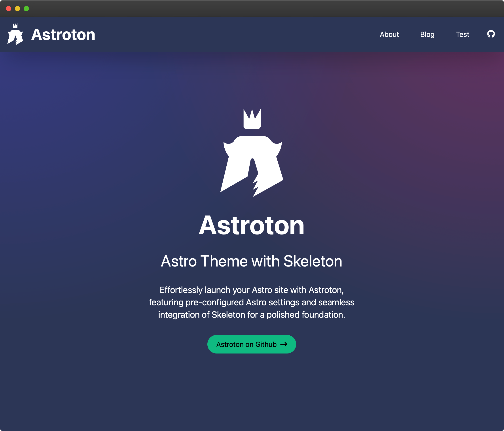

# Astroton: Minimal Astro + Skeleton Starter

**Astroton** combines Astro + Tailwind + Skeleton UI. Quickstart your new Astro site with Skeleton UI. Astroton is theme with the basic settings for Astro + Skeleton already setup for you.

This theme is not production ready (yet), instead can be seen as a starting point for Astro + Skeleton UI

## Repository state
  🟢 Active

Repository was created as a starting point for my own projects that in normal case uses Svelte. Lately i have been switching over to Astro and in need of a starting point with [Skeleton UI](https://www.skeleton.dev/), as i could not find any decided to create my own. There are more updates to be done until it can be set as a more complete theme but it is ready as a starting point.

## Contributing

Contribution is welcome, feel free to open an issue and fork. Waiting for your pull request.

## What's added so far
* Astro 4.0
  * Sitemap **Add-on**
  * ViewTransitions
  * Astro SEO
* Svelte 4.x
  * **Skeleton** (UI Framework for Svelte)
* Tailwind
* Simple Blog

## Astro

## Skeleton
Use all the amazing themes from [Skeleton](https://www.skeleton.dev/) on your [Astro]() site or create your own.

- Skeleton
- Wintry
- Modern
- Rocket
- Seafoam
- Vintage
- Sahara
- Hamlindigo
- Gold Nouveau
- Crimson

Check out more about the themes and how to create new themes in [Skeleton documentation](https://www.skeleton.dev/docs/get-started)

## Commands

| Command                   | Action                                           |
| :------------------------ | :----------------------------------------------- |
| `npm install`             | Installs dependencies                            |
| `npm run dev`             | Starts local dev server at `localhost:4321`      |
| `npm run build`           | Build your production site to `./dist/`          |

## License

**Astroton** is licensed under the MIT license — see the [LICENSE](./LICENSE.md) file for details.